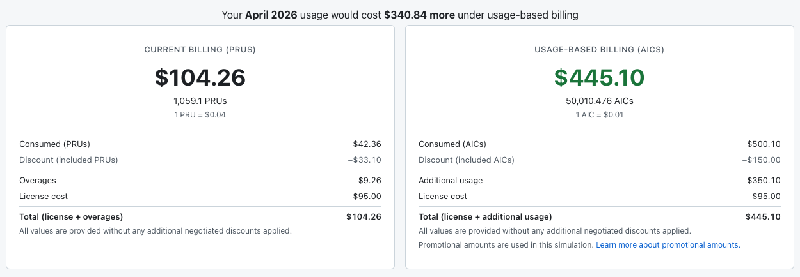

California just gave every one of its state agencies access to Claude at half price, and extended the same deal down to local councils and cities. As an arrangement it's hard to fault - cheaper AI for public servants, training included, one place to buy it through instead of forty. If I ran a government I'd probably take it too. But the number I keep coming back to isn't the discount. It's what it costs to leave, once a whole government has quietly built its work around a single vendor.

I've been thinking about that because we've just been through the very small-business version of the same thing.

At Biz Hub, our AI bill used to be about $120 a month. Predictable, boring, and to be honest it was a steal for the amount of value we got from it as a business. Then the pricing model changed - GitHub moved Copilot toward usage-based billing - and to their credit, before it kicked in they gave us a way to preview the new sticker shock. You could download last month's usage, run it through the new pricing, and get an estimate. We put our April's usage numbers through it and the estimate came back at something over $400, which felt fair enough. Roughly four times the old bill, but that's the deal with usage-based pricing, and at least they'd shown us the maths. This still felt like a decent return on our investment, the product had changed the way we had worked over the past 12 months.

What the tool didn't tell us was how wrong it would be. On the first of June we spent about $150 of credits on the first day. Not the first week - the first day (and three of us had a long coffee and lunch meeting that day). We were now looking at going from around $120 a month to at least $2,000, and the estimate that was meant to prepare us for that undershot it by a mile.

The tool hadn't done anything wrong - it ran our actual April usage through the new pricing and still came in an order of magnitude short, because June wasn't April. Usage doesn't hold still, especially right after you've handed a team a new set of AI tools and encouraged them to lean on them. A forecast built on last month's behaviour is only ever as good as the assumption that next month looks the same, and in AI right now, it doesn't. "Nothing changed" is rarely true - something changed, it just wasn't in the pricing table.

This is the part that makes me cautious about long commitments. Every vendor is offering a discount to lock in for a year, or three, and the discount is real money. But you're locking in a price you can't actually forecast, on a product whose pricing model has changed more than once while you were still reading the last contract. When the ground keeps moving like this, the flexibility to move with it is worth paying a small premium for.

So we changed our minds, which is the whole point of staying flexible. We moved the team off Copilot and onto flat-rate plans instead - Claude Max and OpenAI Codex Pro, split across the office depending on what people prefer, each around $150 a month and both on monthly billing. It's still comfortably less than where the usage-based Copilot bill was heading. More to the point, it's a known number again - not a clever hedge, just something we can plan around, which right now is worth more to us than a discount attached to a bill we can't predict.

Which is why the California deal is interesting to me - not as a criticism of it, half-price AI for the public sector is a genuinely good outcome, but as the same decision at a scale most of us will never touch. When a whole government standardises on one model, the workflows, the training, the integrations and the day-to-day habits all grow around it. That's the entire point of standardising, and it's worth doing. It's also the thing that slowly turns "we could switch" into "we could, technically, if we set aside a year and a budget to do it". The discount is the number on the page. The switching cost is the one that turns up later, and it never appears on the quote.

I've watched this pattern play out for years, well before AI turned up. Enabling an exit is one of the principles we build software on at Biz Hub - it's written into the Skyve manifesto, the line being that if you're not free to leave, you're probably being taken for a ride - and we run into the opposite constantly. Organisations buy Oracle, SAP or Salesforce because it's meant to be off-the-shelf and someone else's problem to run, then spend years and a small fortune customising it until it's effectively bespoke software wearing a vendor's badge. By the time it finally does what they need, the handcuffs are heavy enough that leaving isn't really on the table. California has signed up to the friendly front end of that same curve, and I'm not sure everyone celebrating the press release has clocked where it usually leads.

I don't think there's a clever answer here, and I'd be wary of anyone selling one. Take the discount, standardise where it makes sense, use the tools - just price the exit at the same time you price the entry, and treat any usage forecast as a floor rather than an estimate. We learnt that for about $150 on the first of June. It's a cheaper way to learn it than most.

---

*Sources:*

- [Governor Newsom announces first-of-its-kind partnership providing Anthropic tools to state agencies (Governor of California)](https://www.gov.ca.gov/2026/06/29/governor-newsom-announces-a-first-of-its-kind-partnership-providing-anthropic-tools-to-state-agencies-and-improving-services-for-californians/) - 50% discount on Claude for all state agencies and local governments, via the SITeS portal, with training and technical assistance included.
- [Anthropic and Gov. Newsom forge deal allowing California government to use Claude at half price (TechCrunch)](https://techcrunch.com/2026/06/29/anthropic-and-gov-newsom-forge-deal-allowing-california-government-to-use-claude-at-half-price/)
- [What we Believe - the Skyve manifesto](https://skyve.org/manifesto) - "Exit" is one of Skyve's founding principles: "if you're not free to leave, you're probably being taken for a ride".
